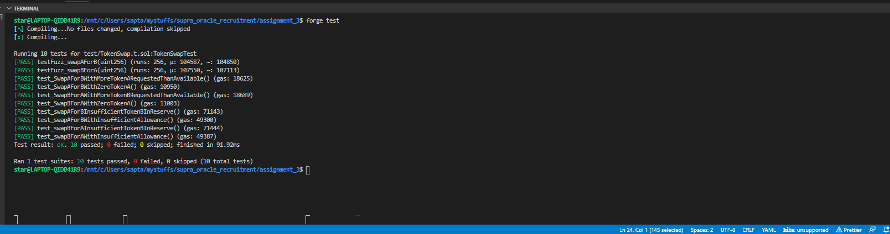

# Token Swap Smart Contract

## Problem Description

Create a smart contract that facilitates the swapping of one ERC-20 token for another at a predefined exchange rate. The smart contract should include the following features:

## Design Choices

- To optimize gas usage, prevent reentrancy attacks, and avoid overflow/underflow vulnerabilities, `SafeERC20` was used for token transfers.
- The contract uses a fixed exchange rate that can be customized during contract deployment.
- An `onlyOwner` based `setExchangeRate` function is provided for fuzz testing and customizing the exchange rate.
- In `SwapBForA`, if there's a remainder after division by the fixed exchange rate, the excess amount of Token B is returned to the user to ensure a consistent exchange.
- The token swap contract maintains a fixed reserve pool of tokens for swapping.

## Security Considerations

- `SafeMath` was used to protect against underflow and overflow vulnerabilities in arithmetic operations.
- `SafeERC20` is used to safeguard against reentrancy attacks and optimize gas usage during token transfers.
- The contract inherits the Ownable contract from OpenZeppelin, ensuring proper access control for setting the exchange rate.
- `require` statements are used to verify the balance of token A and token B reserves in the contract before exchange.
- Another `require` statement checks whether the contract has been granted the appropriate allowance to transfer tokens from the user's address.
- The contract verifies that the user's account has a sufficient balance of `ERC20` tokens, ensuring it's not less than the allowance.
- `SafeTransfer` methods were used to protect against reentrancy attacks during token transfers.

## Test Cases

- Test cases can be found in `TestCases.yml` file in `YML` format, it is written as a YML List format to ensure readability. Here is an example

```yml
- TestCaseId: 1
  TestDescription: accountA swaps 10 tokenA for tokenB.
  Expected: accountA should receive 10*exchange_rate tokenB, and the tokenSwap's reserve should have 1,000,010 token A after the transaction execution, and (1,000,000 - 10*exchange_rate) of tokenB
```

- TestCaseId is the serial number of test case
- TestDescription provides comprehensive description of testcase
- Expected provides the expected output of the testcase

## Test Case Execution Result



## Features

- Users can swap Token A for Token B and vice versa.
- The exchange rate between Token A and Token B is fixed.
- Implement proper checks to ensure that the swap adheres to the exchange rate.
- Include events to log swap details.

## Requirements

- Implement the smart contract in Solidity.
- Use the ERC-20 standard for both tokens.
- Ensure proper error handling and event logging.
- Implement the swap functionality securely and efficiently.
